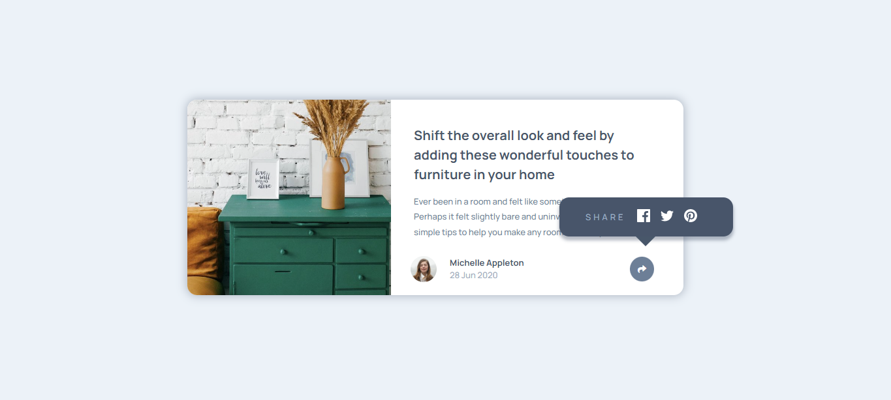
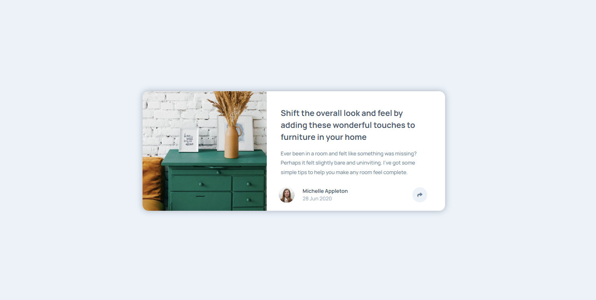
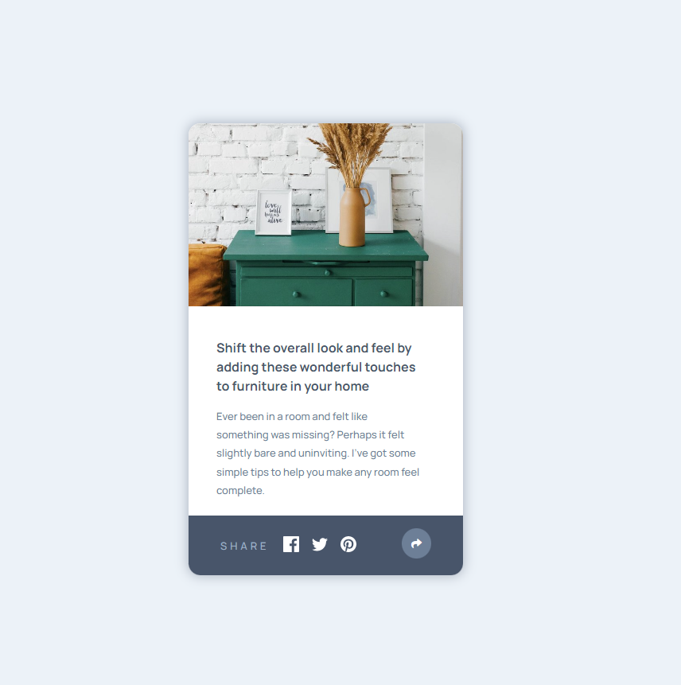
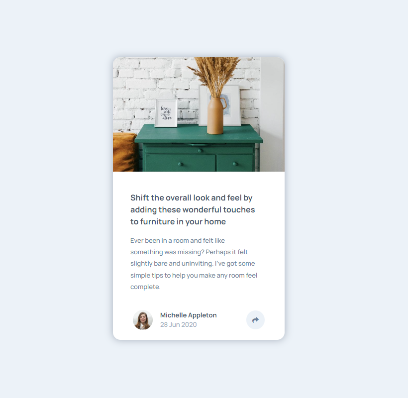

# Frontend Mentor - Article preview component solution

This is a solution to the [Article preview component challenge on Frontend Mentor](https://www.frontendmentor.io/challenges/article-preview-component-dYBN_pYFT). Frontend Mentor challenges help you improve your coding skills by building realistic projects. 

## Table of contents

- [Overview](#overview)
  - [The challenge](#the-challenge)
  - [Screenshot](#screenshot)
  - [Links](#links)
- [My process](#my-process)
  - [Built with](#built-with)
  - [Useful resources](#useful-resources)
- [Author](#author)

## Overview

### The challenge

Users should be able to:

- View the optimal layout for the component depending on their device's screen size
- See the social media share links when they click the share icon

### Screenshot

 
 

### Links

- Solution URL: [Frontent Mentor](https://www.frontendmentor.io/solutions/article-preview-component-6q2Rw-Nn0S)
- Live Site URL: [Live Demo](https://snazzy-rugelach-a6c86e.netlify.app/)

## My process

### Built with

- Semantic HTML5 markup
- CSS custom properties
- Flexbox
- Mobile-first workflow
- Position absolute
- JavaScript

### Useful resources

- [CSS triangle generator](http://apps.eky.hk/css-triangle-generator/) - It helped me create a triangle for the pseudo-element

## Author

- Frontend Mentor - [@xAkashax](https://www.frontendmentor.io/profile/xAkashax)
